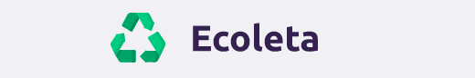
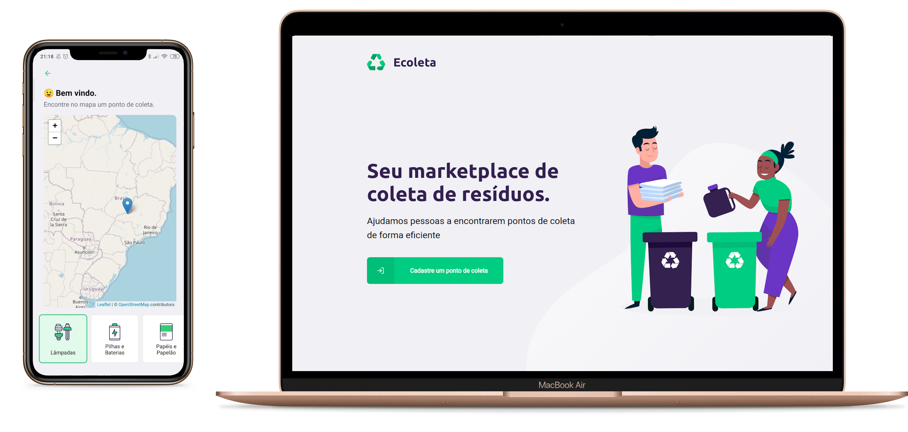

<h1 align="center">
  
</h1>

[BACK-END](#back-end), [FRONT-END](#front-end) and [MOBILE](#mobile) application. Here you will be able to find and register spots for selective collection ♻️🗑

<br><br>

<br>

## BACK-END

### Technologies

- [Node.js](https://nodejs.org/)
- [TypeScript](https://www.typescriptlang.org/)
- [Express](https://expressjs.com/)
- [SQLite](https://www.sqlite.org/index.html)
- [Knex](http://sequelize.org/)
- [Multer](https://github.com/expressjs/multer)

## WEB

### Technologies

- [React](https://reactjs.org/)
- [TypeScript](https://www.typescriptlang.org/)
- [React Router DOM](https://github.com/ReactTraining/react-router/tree/master/packages/react-router-dom)
- [React Icons](https://github.com/react-icons/react-icons)
- [Styled Components](https://styled-components.com/)
- [Axios](https://github.com/axios/axios)
- [Leaflet](https://leafletjs.com/)
- [React Leaflet](https://react-leaflet.js.org/)
- [React Dropzone](https://react-dropzone.js.org/)
- [React Toastfy](https://fkhadra.github.io/react-toastify/introduction/)

<br/>

<p align="center">
  
</p>

<br/>

## MOBILE

### Technologies

- [ReactJS](https://reactjs.org/)
- [React Native](https://reactnative.dev/)
- [TypeScript](https://www.typescriptlang.org/)
- [React Navigation](https://reactnavigation.org/)
- [React Native Vector Icons](https://github.com/oblador/react-native-vector-icons)
- [React Native Webview](https://github.com/react-native-community/react-native-webview)
- [Styled Components](https://styled-components.com/)
- [Axios](https://github.com/axios/axios)

<br/>

<p align="center">
  
</p>

<br/>

## GETTING STARTED

### Requirements

- [Node.js](https://nodejs.org/)
- [Yarn](https://yarnpkg.com/) or [npm](https://www.npmjs.com/)
- [git](https://git-scm.com/)
- [React Native development environment](https://reactnative.dev/docs/environment-setup)

#### Clone the project and access the folder

```shell
$ git clone https://github.com/danielmesquitta/ecoleta && cd ecoleta
```

### Start backend

```shell
# Go to the correct folder
$ cd backend

# Install the dependencies
$ yarn

# Create database and run seeds
$ yarn knex:run-all

# Start
$ yarn start
```

### Start web

```shell
# Go to the correct folder
$ cd frontend

# Install the dependencies
$ yarn

# Start
$ yarn start
```

### Start mobile

```shell
# Go to the correct folder
$ cd mobile

# Install the dependencies
$ yarn

# Start
$ yarn android
```
